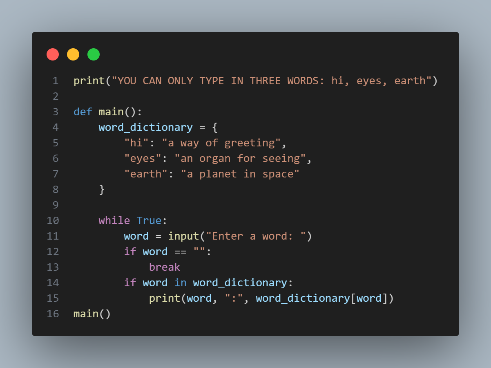

# Word-dictionary

There isn't much code in creating a word dictionary(it only looks for the meaning of three words), just follow these steps:

1. Print the words in your dictionary to the user, so the user will know the words in your dictionary.Then create a def() function with a function(main()). Create var(word_dictionary) then put a dictionary of the words you want to be there(example: word_dictionary = {"earth": "a planet"})
2. Create a while loop, then create a var(word) as an input() function, then print something like(Enter a word:). Create an if statement of if(word == ""), then break(just type 'break'). Create another if statement of if(word in word_dictionary: print(word, ":", word_dictionary[word])).Print out all the code by typing(main())

Thats all for the word dictionary, if you don't understand, look at the image; 